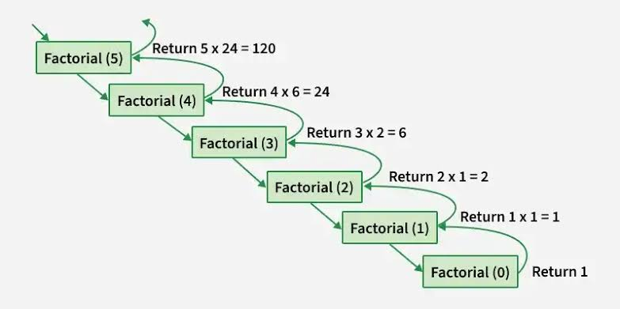

### Notes
- Recursion is basically a function which calls itself .
- In recursion we have two core cases 
    - Base condition - when to stop the recursion
    - Recursive case - where the function calls itself . 
- Recursion and the stacks are closely related . 
### How the call stack works:
- Each function call is pushed onto the call stack
- When a base case is reached, results propagate back up
- The stack unwinds as each call returns its result
- Python call stack for a factorial program
- Recursion Tree or Directed Acyclic Graph 



### Errors we may expect in recursion 
- RecursionError: maximum recursion depth exceeded
    - when the recursive function not meets its base condition , the function keep running eventually it reaches the maximum depth .

### Why we need Recursion 
- While learning recursion i got a doubt , why we need a recursion , what is the difference between the loops and the recursion , if see , loops like for or while they also run until certain condition meets . recursion also same ,it runs until the base condition satisfied
- example : printing numbers from  10 - 1

```python 
# using for loop 
def printNumsWithFor(n):
    for i in range(n, 0, -1):
        print(i)

# Using recursion
def printNumsWithRecursion(n):
    if n == 0:
        return
    print(n)
    printNumsWithRecursion(n - 1)

printNumsWithFor(n=10)
printNumsWithRecursion(n=10)

```
- Recursion can do what loops does . but they are differently built to solve the different problems 
- A loop is run until condition is false , and its straight forward to repeat a set of conditions / statements 
- A recursion is used to solve a bigger problem into smaller and even more smaller to get the results . 

### Testing without Base condition 
- Tested the recursion function without base condition , to print the numbers from 10 - 1 
```bash
-979 
-980
Traceback (most recent call last):
           ^^^^^^^^^^^^^^^^
RecursionError: maximum recursion depth exceeded
PS C:\Users\stude\OneDrive\Desktop\100_Days_Of_Code> 
```